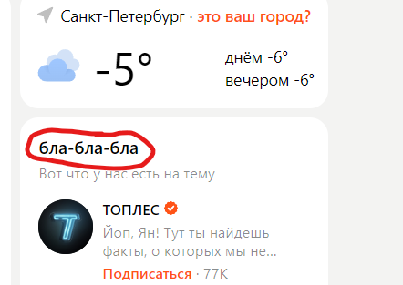

# Задача: на основе сайта yandex.ru: 

**1. Определите, на каком протоколе работает сайт  yandex.ru:**

**2. Проанализируйте структуру страницы сайта.**

**3. Внесите не менее 10 изменений на страницу с помощью инструмента разработчика и представьте скриншоты было/стало.**

**4. Создайте прототип низкой детализации (дополнительное задание, если на семинаре дошли до задания №8).**

__________________________________________________________________

## 1) Сайт работает на протоколе https.

## 2) Струрктура сайта состоит из: 
 * Header (писковая система)
 * контент (это Дзен, новости, блоги людей, статьи, реклама )
 * сайт бары: Дзен путеводитель, погода, Кино

## 3) 10 изменений сайта yandex:

* оригинал

*  изменение №1

*  изменение №2

*  изменение №3

*  изменение №4

*  изменение №5

*  изменение №6

*  изменение №7

*  изменение №8

*  изменение №9

*  изменение №10

__________________________________________________

## 4) прототип низкой детализации

